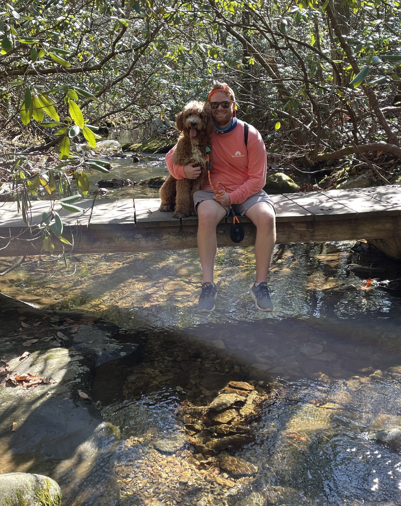

```{r setup, include=FALSE}
knitr::opts_chunk$set(echo = TRUE)
```



Hello! Thank you for coming to take a look at my website. My name is Doug Neumann and I am a graduate student in the Analytics and Data Science Masters program at Georgetown University in Washington D.C.

During the last two years I have been on sabbatical from the United States Coast Guard. My carreer has consisted of working in counter-narcotics in Central and South America as well is in Port Operations in the ports of New York and Houston. Upon Completion of my Masters Degree I will return to where I completed my undergraduate degreee; the United States Coast Guard Academy in New London, Connnecticut to teach in the Mathematics Department.
